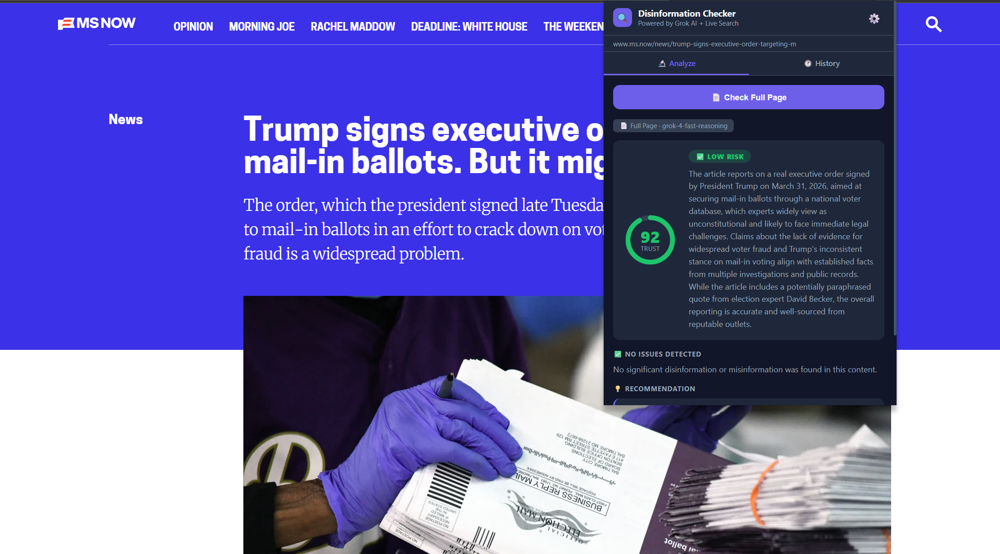
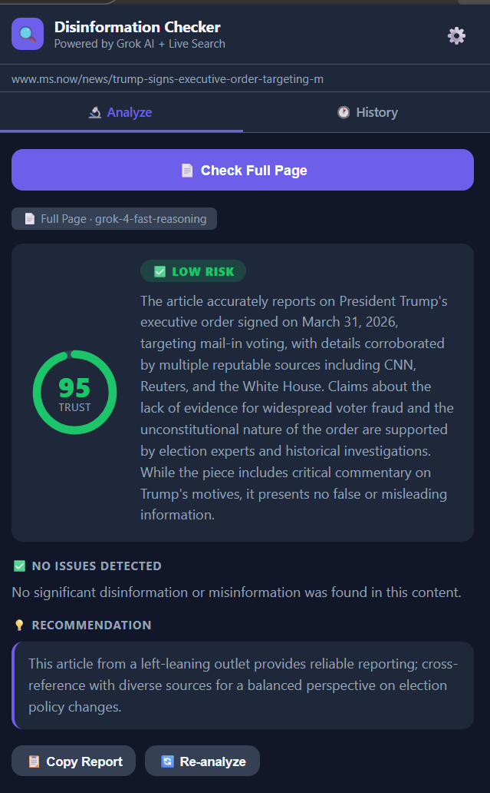
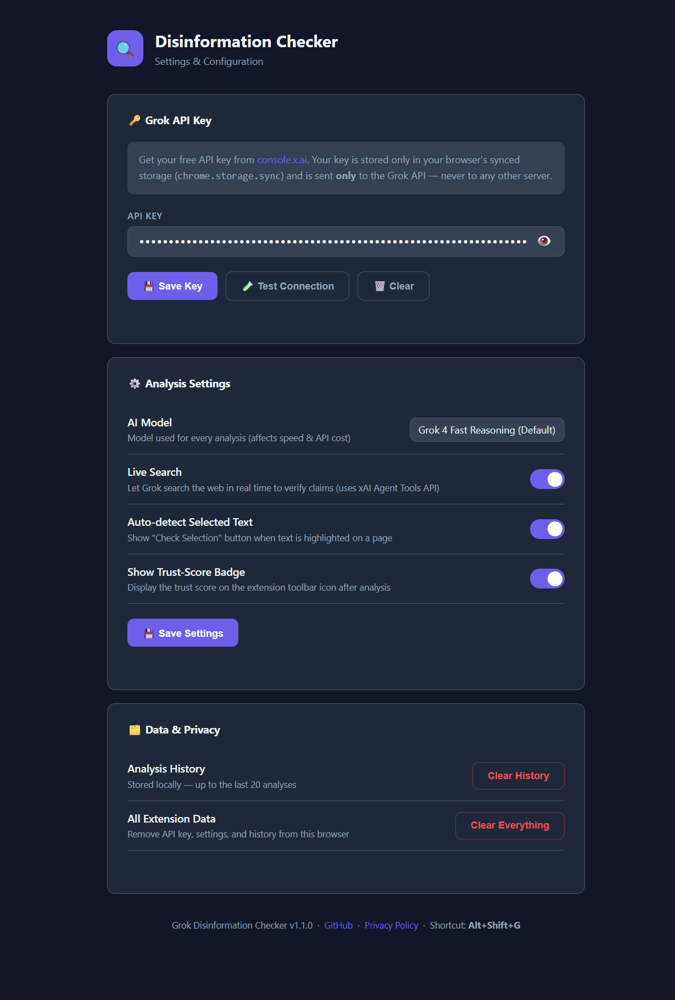

# 🔍 Grok Disinformation Checker

A browser extension for **Chrome** and **Microsoft Edge** that instantly analyzes any web page or selected text for disinformation, misinformation, and false claims — powered by [xAI's Grok AI](https://x.ai) with real-time Live Search.



---

**NOTE:** You can also install this from the Google Chrome Web store: https://chromewebstore.google.com/detail/grok-disinformation-check/fcigpopdcbiilnkdidokpmkcehemeljl

## ✨ Features

| Feature | Description |
|---|---|
| 📄 **Full Page Analysis** | Scans the entire visible text of any web page for disinformation |
| ✂️ **Selected Text Analysis** | Highlight any text, right-click, and check just that snippet |
| 📊 **Trust Score (0–100)** | Animated ring gauge — color-coded from green (safe) to red (critical) |
| 🔍 **Live Search** | Grok searches the web in real time to cross-reference facts as it analyzes |
| 🕐 **Analysis History** | Last 20 analyses stored locally and browsable inside the extension |
| 📋 **Copy Report** | Export a full plain-text analysis report to your clipboard |
| ⌨️ **Keyboard Shortcut** | Press `Alt+Shift+G` to check the current page instantly |
| 🖱️ **Right-Click Menu** | Context menu on any page or selection — no need to open the popup |
| 🏷️ **Toolbar Badge** | Trust score appears on the extension icon after each analysis |
| 🎨 **Dark / Light / System Theme** | Follows your OS or choose your preferred appearance in Settings |
| ⚙️ **Settings Page** | Configure API key, model, live search, badge, theme, and history |

---

## 📸 Screenshots

<table>
  <tr>
    <td align="center"><strong>Popup — Analysis Result</strong></td>
    <td align="center"><strong>Full Disinformation Panel</strong></td>
    <td align="center"><strong>Settings Page</strong></td>
  </tr>
  <tr>
    <td></td>
    <td></td>
    <td></td>
  </tr>
</table>

---

## 🚀 Getting Started

### 1 — Get a Grok API Key

1. Go to [console.x.ai](https://console.x.ai) and sign in with your X account.
2. Create a new API key. It will start with `xai-`.
3. Copy it — you'll paste it into the extension Settings.

> A free tier is available. Costs scale with usage; Live Search (web_search tool) requires a **grok-4 family model**.

---

### 2 — Install the Extension

**Chrome / Edge (Developer Mode)**

1. Download or clone this repository:
   ```bash
   git clone https://github.com/rod-trent/GrokDisinformationChecker.git
   ```
2. Open your browser and navigate to the extensions page:
   - Chrome: `chrome://extensions`
   - Edge: `edge://extensions`
3. Enable **Developer mode** (toggle in the top-right corner).
4. Click **Load unpacked** and select the cloned folder.
5. The 🔍 icon will appear in your toolbar.

> **Icons:** If the toolbar icon appears blank, open `generate_icons.html` in your browser, download the four PNG files, and place them in the `icons/` subfolder.

---

### 3 — Add Your API Key

1. Click the 🔍 toolbar icon, then click **⚙️** (Settings).
2. Paste your `xai-...` API key into the **API Key** field.
3. Click **💾 Save Key**.
4. Optionally click **🧪 Test Connection** to verify it works.

---

## 🔬 How to Use

### Check a Full Page
Click the 🔍 toolbar icon → **📄 Check Full Page**.

### Check Selected Text
Highlight any text on a page → either:
- Click **✂️ Check Selection** in the popup, or
- Right-click → **🔍 Check with Grok: "…"**

### Keyboard Shortcut
Press **`Alt+Shift+G`** anywhere to trigger a full-page check.

### Reading the Results

| Trust Score | Risk Level | Meaning |
|---|---|---|
| 80 – 100 | 🟢 **LOW** | Content appears accurate and well-sourced |
| 50 – 79 | 🟡 **MEDIUM** | Some unverified or potentially misleading elements |
| 30 – 49 | 🟠 **HIGH** | Significant misinformation detected |
| 0 – 29 | 🔴 **CRITICAL** | Severe disinformation — treat with extreme caution |

Each analysis includes:
- A **summary** of findings
- Individual **issue cards** listing specific claims and verdicts
- **Source references** where Grok found supporting evidence
- A **recommendation** for the reader

---

## ⚙️ Settings

Open Settings via the **⚙️** icon in the popup or by right-clicking the extension icon → *Options*.

| Setting | Default | Description |
|---|---|---|
| API Key | — | Your xAI Grok API key |
| AI Model | Grok 4 Fast Reasoning | Model used for analysis |
| Live Search | On | Real-time web search to verify claims |
| Auto-detect Selection | On | Show "Check Selection" when text is highlighted |
| Show Badge | On | Display trust score on toolbar icon |
| Appearance | System | Dark / Light / System (follows OS) |

> **Note:** Live Search requires a **grok-4 family model**. If you select an older model with Live Search enabled, it automatically upgrades to `grok-4-fast-reasoning` for that request.

---

## 🗂️ Project Structure

```
GrokDisinformationChecker/
├── manifest.json          # Extension manifest (MV3)
├── popup.html             # Extension popup UI
├── popup.js               # Popup logic — analysis, history, theming
├── background.js          # Service worker — context menus, shortcuts, badge
├── options.html           # Settings page UI
├── options.js             # Settings page logic
├── privacy.html           # Privacy policy (required for store submission)
├── generate_icons.html    # In-browser tool to generate PNG icon files
├── STORE_LISTING.md       # Ready-to-paste Chrome/Edge store listing copy
├── icons/                 # Extension icons (16, 32, 48, 128px)
└── images/                # Screenshots
```

---

## 🔒 Privacy

- Page content is sent **only** to the [xAI Grok API](https://api.x.ai) — nowhere else.
- Your API key is stored in `chrome.storage.sync` inside your own browser.
- The developer receives **zero** telemetry, analytics, or user data.
- Analysis history is stored locally on your device only.
- Uninstalling the extension removes all stored data.

See the full [Privacy Policy](privacy.html) for details.

---

## 🛠️ Tech Stack

- **Manifest V3** Chrome Extension
- **xAI Grok API** — [Responses API](https://docs.x.ai/docs) (`/v1/responses`)
- **Live Search** via `web_search` Agent Tool (grok-4 family only)
- Vanilla HTML / CSS / JavaScript — no build step, no dependencies

---

## 🤝 Contributing

Issues and pull requests are welcome!

1. Fork the repository
2. Create a feature branch: `git checkout -b feature/my-feature`
3. Commit your changes
4. Open a pull request against `main`

---

## 📄 License

[MIT License](LICENSE) — see `LICENSE` for details.

---

## 🙏 Acknowledgements

- [xAI](https://x.ai) for the Grok API and Live Search capability
- Built to help people navigate an increasingly complex information landscape

---

*For questions or issues, please [open a GitHub issue](https://github.com/rod-trent/GrokDisinformationChecker/issues).*
